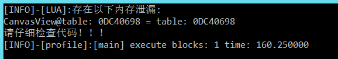

# 内存泄露检测（myc）
对于游戏开发而言，内存泄露往往是最容易忽视的问题，很多开发者并不知道自己的代码是否存在内存泄露，在公司引擎的历史中，5.0引擎版本之前经常容易出现res is nil（友盟上非常多此类错误），5.0版本经常出现 _layer is nil ,此类问题都是典型的内存泄露问题，往往对象已经从场景上销毁，但是事件监听或者回调函数，协程里面还存在着该对象的引用，等到回调触发，或者协程恢复就会报该类错误（因为对象已经销毁），那么此类问题可以借助GameMonitor来检测，具体原理是借助lua的弱引用，把某个需要观察的对象加入到弱表，如果不存在外部引用，那么在gc时候，弱表上的该对象也就自然消失，如果弱表还存在该对象，说明外部存在引用，详细细节可以自行百度，下面说一下如何使用

给某个模块（场景）加入内存泄露检测，然后打开该模块，再关闭该模块，然后按键盘M键，观看日志输出， 如果按键没反应，那么需要在响应按键的地方加上代码，其实就是触发GameMonitor

按键代码
```lua
local main_window = import("bos.engine.window").main_window
local WINDOW = main_window.window
local MemoryMonitor = import("bos.core.monitor").MemoryMonitor
---引擎相应按键事件
WINDOW.internal_delegate.on_key = function(self, key, action, mods, keyboard_on)

    if key == 77 then --按键M
        MemoryMonitor:update(10);
    end
end
```

监控示例
```lua
    local MemoryMonitor = import("bos.core.monitor").MemoryMonitor
    local CanvasView = class(UI.View);
    CanvasView.className_ = "CanvasView";--类名
    function CanvasView:ctor()
        self.m_name = "CanvasView";
        self:initProps()
        self:loadLayout();
        self:bindCtr();
        self:findView();
        MemoryMonitor:add_to_leak_monitor(self,"CanvasView", );--传入该模块引用，第2个参数是别名，日志输出的名字
    end
```

如果按键之后没输出异常，那么说明该模块没有内存，如果存在泄漏则输出如下：



最常见的内存泄漏就是注册了事件监听没有反注册，所以遇到此类问题先检查是否反注册了事件，其余的就是回调函数，协程内部等，需要开发人员自行定位，但是大体上都是此类问题了
